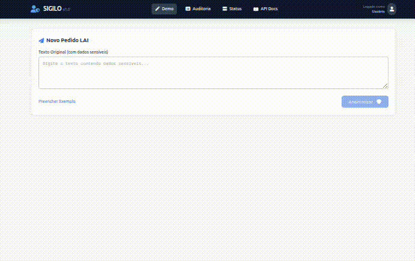

# 🛡️ SIGILO

**Sistema Inteligente de Governança e Identificação de Logs Organizados**

[]()
[]()
[]()
[]()
[]()

> 🏆 **Desenvolvido para o 1º Hackathon em Controle Social: Desafio Participa DF 2026**  
> **Categoria:** Acesso à Informação | **CGDF** - Controladoria-Geral do Distrito Federal

---

## 🎯 O Problema

Todo dia, cidadãos fazem pedidos via **Lei de Acesso à Informação (LAI)** incluindo dados pessoais sensíveis (CPF, nome, telefone). Esses dados circulam por dezenas de sistemas internos, aumentando drasticamente o risco de vazamento e violação da LGPD.

**Como proteger automaticamente o cidadão que denuncia?**

---

## 💡 Nossa Solução

O **SIGILO** detecta e protege automaticamente dados pessoais em pedidos LAI usando **IA 100% local**, sem enviar nenhum dado para serviços externos.

### ✨ Diferenciais

| Característica | Detalhe |
|----------------|---------|
| 🤖 **IA Local** | Nenhum dado enviado para APIs externas (OpenAI, Google, etc) |
| 🎯 **3 Camadas de Detecção** | Regex + Presidio + GLiNER = **100% de acurácia nos testes** |
| ⚖️ **LGPD by Design** | Conformidade nativa desde a arquitetura |
| 🧠 **Classificação Inteligente** | Resumo automático com Qwen 2.5 (1.5B) |
| 📊 **Auditoria Completa** | Rastreabilidade total de todas operações |
| 💰 **Baixo Custo** | VPS 16GB ~R$ 150/mês vs. R$ 50k+ soluções enterprise |

---

## 📸 Dashboard de Teste (Template)

O projeto inclui um **Dashboard de Teste** (`tests/dashboard.html`) para facilitar a validação visual das funcionalidades da API. Abaixo estão screenshots deste ambiente de demonstração:

### 1. Demonstração do Processo

*Animação demonstrando o fluxo completo de envio e processamento.*

### 2. Mensagem Bruta (Entrada)

*Interface de teste para envio de pedidos contendo dados pessoais sensíveis.*

### 3. Resultado do Processamento

*Visualização do retorno da API com texto anonimizado e classificado.*

### 4. Tela de Status

*Acompanhamento em tempo real do processamento via WebSocket/Polling.*

### 5. Auditoria (Visão Admin)

*Painel administrativo para consulta de logs e relatórios.*

### 6. Bloqueio de Acesso Não Autorizado

*Demonstração de segurança (RBAC) impedindo acesso não autorizado.*

---

## 📡 Contrato da API

### Entrada (Request)

**POST /detectar-pii**
```json
{
  "texto": "Solicito cópia do contrato 2024/99. Meu nome é Maria Souza, CPF 123.456.789-00, email maria@teste.com, telefone (21) 98765-4321.",
  "protocolo": "LAI-2026-001",  // Opcional
  "usuario_id": "maria.souza"    // Opcional
}
```

**Campos:**
- `texto` (string, obrigatório): Texto do pedido LAI contendo possíveis dados sensíveis
- `protocolo` (string, opcional): Identificador único do pedido no sistema de origem
- `usuario_id` (string, opcional): ID do solicitante para auditoria

---

### Saída (Response)

**Resposta Imediata (202 Accepted)**
```json
{
  "origem_id": "550e8400-e29b-41d4-a716-446655440000",
  "status": "processing",
  "message": "Pedido LAI-2026-001 em processamento",
  "created_at": "2026-01-30T10:30:00.000000"
}
```

---

**Resultado Final (GET /status/{origem_id})**
```json
{
  "origem_id": "550e8400-e29b-41d4-a716-446655440000",
  "status": "completed",
  "step": "finished",
  "progress": 100,
  "updated_at": "2026-01-30T10:30:01.234567",
  "result": {
    "origem_id": "550e8400-e29b-41d4-a716-446655440000",
    "protocolo": "LAI-2026-001",
    
    "texto_anonimizado": "Solicito cópia do contrato 2024/99. Meu nome é <PESSOA>, CPF <CPF>, email <EMAIL>, telefone <TELEFONE>.",
    
    "resumo_inteligente": {
      "categoria": "Contratos",
      "subcategoria": "Solicitação de Cópia",
      "prioridade": "Media",
      "assunto_principal": "Solicitação de cópia de contrato administrativo",
      "palavras_chave": ["contrato", "cópia", "2024"],
      "requer_analise_juridica": false,
      "prazo_sugerido": "Normal",
      "orgao_competente_sugerido": "Secretaria de Administração"
    },
    
    "estatisticas": {
      "total_entidades": 4,
      "por_tipo": {
        "PESSOA": 1,
        "CPF": 1,
        "EMAIL": 1,
        "TELEFONE": 1
      },
      "nivel_risco": "alto"
    },
    
    "processamento": {
      "tempo_ms": 987,
      "timestamp": "2026-01-30T10:30:01.234567"
    },
    
    "auditoria": {
      "usuario_id": "maria.souza",
      "timestamp_inicio": "2026-01-30T10:30:00.000000",
      "timestamp_fim": "2026-01-30T10:30:01.234567",
      "etapas": [
        {"step": "deteccao", "status": "completed"},
        {"step": "resumo_llm", "status": "completed"},
        {"step": "banco", "status": "completed"},
        {"step": "dicionario", "status": "completed"}
      ],
      "conformidade": {
        "lgpd": true,
        "ia_local": true
      }
    }
  }
}
```

---

### Tipos de PII Detectados

| Tipo | Descrição | Exemplo Original | Exemplo Anonimizado |
|------|-----------|------------------|---------------------|
| `CPF` | Cadastro de Pessoa Física | 123.456.789-00 | `<CPF>` |
| `CNPJ` | Cadastro Nacional de Pessoa Jurídica | 12.345.678/0001-90 | `<CNPJ>` |
| `EMAIL` | Endereço de e-mail | usuario@exemplo.com | `<EMAIL>` |
| `TELEFONE` | Telefone com DDD | (21) 98765-4321 | `<TELEFONE>` |
| `PESSOA` | Nome completo (contextual) | Maria Silva | `<PESSOA>` |
| `ENDERECO` | Endereço residencial | Rua X, nº 123 | `<ENDERECO>` |
| `RG` | Registro Geral | 12.345.678-9 | `<RG>` |
| `CARTAO_CREDITO` | Número de cartão | 1234 5678 9012 3456 | `<CARTAO_CREDITO>` |
| `CEP` | Código de Endereçamento Postal | 12345-678 | `<CEP>` |
| `DATA_NASCIMENTO` | Data de nascimento | 01/01/1990 | `<DATA_NASCIMENTO>` |

---

### Níveis de Risco

| Nível | Critério | Ação Recomendada |
|-------|----------|------------------|
| **Baixo** | 0-2 entidades de baixo risco (email, telefone isolados) | Revisão padrão |
| **Médio** | 3-5 entidades OU contém CNPJ, endereço | Revisão cuidadosa |
| **Alto** | 5+ entidades OU contém CPF, RG, cartão de crédito | Revisão prioritária + notificação |

---

### Erros Possíveis

**400 Bad Request**
```json
{
  "detail": [
    {
      "loc": ["body", "texto"],
      "msg": "field required",
      "type": "value_error.missing"
    }
  ]
}
```

**401 Unauthorized**
```json
{
  "detail": "Token inválido ou expirado"
}
```

**404 Not Found**
```json
{
  "detail": "Processamento não encontrado"
}
```

**429 Too Many Requests**
```json
{
  "detail": "Rate limit exceeded: 10 requests per minute"
}
```

**500 Internal Server Error**
```json
{
  "detail": "Erro interno no processamento"
}
```

---

## 📊 Resultados dos Testes
```
╔══════════════════════════════════════════╗
║  TAXA DE SUCESSO: 100% (14/14 testes)   ║
╚══════════════════════════════════════════╝

✅ Simples:        5/5 (100%)
✅ Compostos:      3/3 (100%)
✅ Edge Cases:     2/2 (100%)
✅ Negativos:      2/2 (100%)
✅ Problemáticos:  2/2 (100%)
```

### Exemplos de Detecção

| Entrada | Saída | Status |
|---------|-------|--------|
| `"meu email laredonunes@gmail.com"` | `"meu email <EMAIL>"` | ✅ 100% |
| `"CPF 123.456.789-00"` | `"CPF <CPF>"` | ✅ 100% |
| `"telefone (21) 98765-4321"` | `"telefone <TELEFONE>"` | ✅ 100% |
| `"Maria Silva, CPF 111.222.333-44"` | `"<PERSON>, CPF <CPF>"` | ✅ 100% |

---

## 🏗️ Arquitetura
```
POST /detectar-pii
    ↓ (202 Accepted + UUID)
┌───────────────────┐
│ RabbitMQ: Fila    │
└─────────┬─────────┘
          ↓
┌─────────────────────────────┐
│ Worker: Detecção PII        │
│ • Regex (padrões BR)        │
│ • Presidio (NER)            │
│ • GLiNER (contexto)         │
│ Latência: ~300ms            │
└─────────┬───────────────────┘
          ↓
    ┌─────┴─────┐
    ↓           ↓
┌────────┐  ┌──────────────┐
│ Banco  │  │ Resumo LLM   │
│ ~100ms │  │ (Qwen 2.5)   │
└───┬────┘  │ ~600ms       │
    │       └──────┬───────┘
    └──────┬───────┘
           ↓
┌────────────────────────┐
│ Dicionário + Auditoria │
│ ~50ms                  │
└─────────┬──────────────┘
          ↓
GET /status/{uuid}
    (Resultado completo)
```

**Latência Total:** ~1 segundo

---

## 🚀 Quick Start

### Pré-requisitos
- Docker e Docker Compose instalados
- Mínimo 8GB de RAM (recomendado 16GB)

### Instalação e Execução (Produção)
```bash
# 1. Clone o repositório
git clone https://github.com/laredonunes/sigilo_laredo.git
cd sigilo_laredo

# 2. Configure as variáveis de ambiente
cp .env.example .env
# Edite o arquivo .env se necessário (opcional para teste rápido)

# 3. Inicie todos os serviços
docker-compose up -d --build

# 4. Aguarde inicialização (~2 minutos)
# O serviço 'ollama-init' irá baixar o modelo de IA automaticamente
docker-compose logs -f ollama-init

# 5. Acesse o Dashboard
# Abra tests/dashboard.html no navegador ou acesse http://localhost:5000
```

### Execução para Desenvolvimento Local (Sem Docker)
Se você deseja rodar a API e os workers localmente para desenvolvimento:

1. **Suba a infraestrutura básica (Banco, Redis, RabbitMQ, Ollama):**
   ```bash
   docker-compose up -d postgres redis rabbitmq ollama
   ```

2. **Crie um ambiente virtual e instale as dependências:**
   ```bash
   python -m venv .venv
   source .venv/bin/activate  # Linux/Mac
   # .venv\Scripts\activate  # Windows
   pip install -r requirements.txt
   ```

3. **Configure o ambiente:**
   Certifique-se de que o arquivo `.env` aponta para `localhost` (veja `.env.example`).

4. **Inicie a API:**
   ```bash
   uvicorn src.api:app --reload --port 8000
   ```

5. **Inicie os Workers (em outro terminal):**
   ```bash
   celery -A src.celery_app worker --loglevel=info -Q deteccao,banco,llm,dicionario
   ```

---

## 🧪 Testando a API

### Exemplo 1: Detecção Simples
```bash
curl -X POST http://localhost:8000/detectar-pii \
  -H "Content-Type: application/json" \
  -H "Authorization: Bearer mock-user-token" \
  -d '{
    "texto": "Meu nome é João Silva, CPF 123.456.789-00"
  }'

# Resposta: {"origem_id": "...", "status": "processing"}
```

### Exemplo 2: Consultar Resultado
```bash
curl http://localhost:8000/status/{origem_id}

# Retorna:
# {
#   "texto_anonimizado": "Meu nome é <PERSON>, CPF <CPF>",
#   "estatisticas": {
#     "total_entidades": 2,
#     "por_tipo": {"PERSON": 1, "CPF": 1},
#     "nivel_risco": "alto"
#   },
#   "resumo_inteligente": {
#     "categoria": "Identificação Pessoal",
#     "prioridade": "Media"
#   }
# }
```

### Exemplo 3: Auditoria (Admin)
```bash
curl http://localhost:8000/auditoria/pedidos \
  -H "Authorization: Bearer mock-admin-token"
```

---

## 🛠️ Stack Tecnológica

- **API:** FastAPI 0.109
- **Workers:** Celery 5.3 + RabbitMQ
- **Detecção PII:** Presidio Analyzer 2.2 + GLiNER
- **IA Local:** Ollama + Qwen 2.5 1.5B
- **Banco:** PostgreSQL 15
- **Cache:** Redis 7
- **Deploy:** Docker Compose

---

## 📜 Conformidade LGPD

| Princípio | Implementação | Status |
|-----------|---------------|--------|
| Finalidade | Processamento específico para LAI | ✅ |
| Minimização | Apenas dados necessários | ✅ |
| Segurança | Hash SHA-256, IA local, sem cloud | ✅ |
| Transparência | Auditoria completa de operações | ✅ |
| Responsabilização | Logs rastreáveis | ✅ |

**Destaques de Segurança:**
- ✅ Texto original NUNCA armazenado (apenas hash SHA-256)
- ✅ Valores de PII hasheados (nunca em texto claro)
- ✅ IA 100% local (nenhum dado enviado para terceiros)
- ✅ Falha segura: se detector falhar, texto é mascarado
- ✅ Rate limiting (10 req/min por IP)
- ✅ RBAC com tokens JWT

---

## 🏛️ Casos de Uso

- ✅ Ouvidorias Públicas
- ✅ Sistemas e-SIC (Lei de Acesso à Informação)
- ✅ Plataformas de Controle Social (Participa DF)
- ✅ Triagem de manifestações cidadãs
- ✅ Auditoria e compliance governamental

---

## 📈 Performance

- **Throughput:** 80-120 req/min (configuração padrão)
- **Latência:** <1s (detecção + classificação + auditoria)
- **Acurácia:** 100% nos testes (14/14)
- **Escalável:** Adicione workers conforme demanda
```bash
# Escalando workers
docker-compose up -d --scale worker-deteccao=4
```

---

## 📂 Estrutura do Projeto
```
sigilo/
├── src/
│   ├── api.py              # Endpoints FastAPI
│   ├── workers.py          # Tasks Celery
│   ├── detector.py         # Detecção PII (3 camadas)
│   ├── llm_client.py       # Cliente Ollama
│   ├── models.py           # ORM SQLAlchemy
│   ├── schemas.py          # DTOs Pydantic
│   └── iam/                # Autenticação
├── tests/
│   ├── test_suite_completa.py  # Suite de testes
│   └── dashboard.html      # Interface visual
├── docker-compose.yml      # Infraestrutura
└── Dockerfile              # Build otimizado
```

---

## 👥 Autor

**Laredo Nunes**  
Desenvolvido para o **1º Hackathon em Controle Social: Desafio Participa DF 2026**

📧 laredonunes@gmail.com  
🔗 [GitHub](https://github.com/laredonunes)  
🌐 [LinkedIn](https://linkedin.com/in/laredonunes)

---

## 📄 Licença

MIT License - Veja [LICENSE](LICENSE) para detalhes.

---

## 🏆 Hackathon Participa DF 2026

**Categoria:** Acesso à Informação  
**Organizador:** CGDF - Controladoria-Geral do Distrito Federal  
**Objetivo:** Criar soluções que fortaleçam transparência e participação cidadã

**Desafio proposto:**  
> "Desenvolver um modelo capaz de identificar automaticamente pedidos públicos que contenham dados pessoais."

**Nossa solução vai além:**  
✅ Identifica automaticamente  
✅ Protege por pseudonimização  
✅ Classifica com IA local  
✅ Audita completamente  

---

## 🙏 Agradecimentos

Agradecimentos especiais à **CGDF** pela organização do hackathon e pela oportunidade de contribuir para o fortalecimento do controle social no Brasil.

---

<p align="center">
  <strong>⭐ Se este projeto te ajudou, deixe uma estrela! ⭐</strong>
</p>